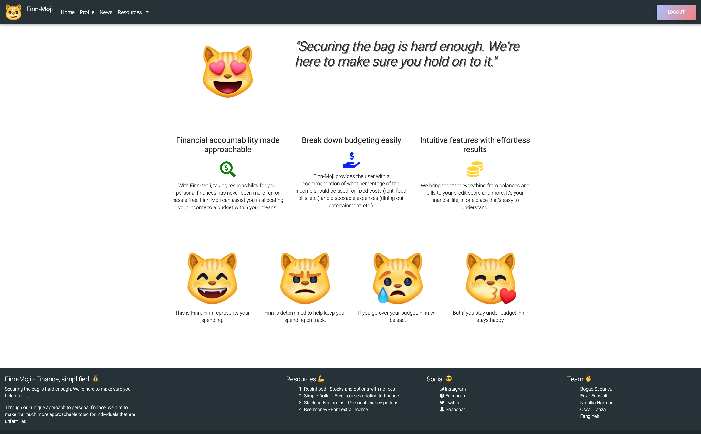
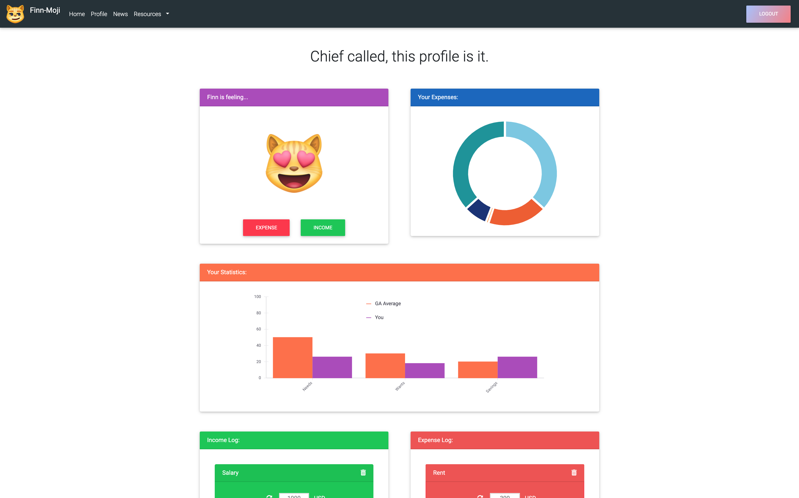

# Finn-Moji :smiley_cat:

With Finn-Moji, taking responsibility for your personal finances has never been more fun or hassle-free. Finn-Moji can assist you in allocating your income to a budget within your means.

### Overview

"Nearly 7 in 10 Americans have only $1,000 or less in their savings accounts. Out of 7,000 people around the country, 34% of them have nothing at all set aside in savings." [Forbes](https://www.forbes.com/sites/niallmccarthy/2016/09/23/survey-69-of-americans-have-less-than-1000-in-savings-infographic/#110147ed1ae6)

Money is oftentimes an uncomfortable subject. Our goal is to make financial responsibility simple, approachable, and interactive.

Backed by market research, Finn-Moji provides the user with a recommendation of what percentage of their income should be used for fixed costs (rent, food, bills, etc.) and disposable expenses (dining out, entertainment, etc.). 

Your budget is represented by our sprite, Finn. The better you take care of your budget, the happier Finn is. But if you go over your budget, Finn will be sad.

### Technologies Used

- React
- MDBReact
- React-Vis
- React-Typist
- MongoDB/Mongoose

### Future Improvements

- Adding custom tips and trips to help increase savings, stretch a user's budget, manage money
- Incorporating "age range" to help young children/teenagers learn financial responsibility at an early age

### Links

- [Github](https://github.com/BogacSabuncu/final-project)
- [Application](https://finn-moji.herokuapp.com)

### Meet the Team

- [Bogac Sabuncu](https://github.com/BogacSabuncu): Project Manager
- [Enzo Fass](https://github.com/enzofass): Back-End
- [Natallia Harmon](https://github.com/natalliasdh): Back-End
- [Oscar Lanza](https://github.com/olanza): Front-End
- [Fang Yeh](https://github.com/fyeh0): Front-End

